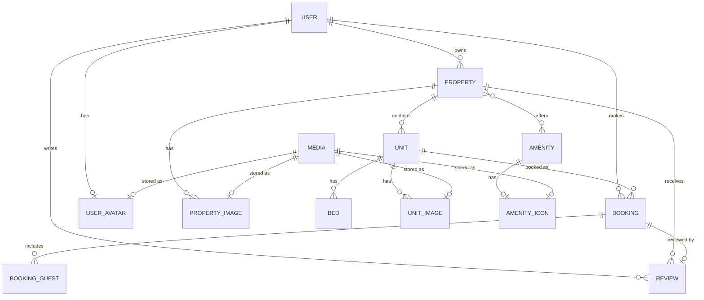

# T-Book — Property Booking Platform


**REST API for a hotel/apartment booking platform.**
Built with Django + Django REST Framework. Supports property & unit management, JWT authentication, bookings with an owner/guest workflow, reviews and media (image) uploads.

## Live Demo

🌐 **Production:** https://t-book.duckdns.org/

📖 **Swagger UI:** https://t-book.duckdns.org/api/schema/swagger-ui/

📄 **ReDoc:** https://t-book.duckdns.org/api/schema/redoc/

---

## 1. Project Overview

T-Book is a backend REST API that models a short-term rental / hotel booking service (in the spirit of Airbnb / Booking.com). The domain is split into independent Django apps, each responsible for one bounded context:

| App | Responsibility |
|---|---|
| `users` | Custom user model, registration, JWT login, profile, password change |
| `property` | Properties (hotels, hostels, apartments, villas, houses), their units/rooms, beds, amenities |
| `listings` | Public read-only catalog/search over properties (browsing endpoint for guests) |
| `bookings` | Booking lifecycle: create, confirm, reject, cancel, complete — separate flows for guests (users) and owners |
| `reviews` | Ratings & reviews left by users for completed bookings |
| `media` | Image upload/management for properties, units, amenities and user avatars |
| `common` | Shared abstract models (UUID, timestamps, soft-delete), mixins, pagination |

### Key features
- JWT-based authentication (access/refresh tokens, blacklisting on rotation)
- Role-based access: `user`, `owner`, `admin`
- Soft-delete on core domain models (nothing is hard-deleted by default)
- UUID public identifiers for every resource (no sequential integer IDs exposed)
- Image upload & ordering/cover-image management for properties and units
- Auto-generated OpenAPI schema with Swagger UI / ReDoc (via `drf-spectacular`)
- Request throttling (per-user and per-anonymous rate limits)
- Dockerized deployment behind Nginx with Gunicorn + PostgreSQL

---

## 2. Technology Stack

| Layer | Technology |
|---|---|
| Language | Python 3.13 |
| Web framework | Django 6.0 |
| API framework | Django REST Framework |
| Authentication | `djangorestframework-simplejwt` (JWT) |
| API documentation | `drf-spectacular` (OpenAPI 3 schema, Swagger UI, ReDoc) |
| Filtering | `django-filter` |
| CORS | `django-cors-headers` |
| Debugging | `django-debug-toolbar` (dev only) |
| Config / secrets | `django-environ` (`.env` files) |
| Images | `Pillow` |
| Database (prod) | PostgreSQL 17 (via `psycopg[binary]`) |
| Database (local/dev) | SQLite (fallback when `USE_REMOTE=False`) |
| App server | Gunicorn (WSGI) |
| Reverse proxy | Nginx (serves `/static/`, `/media/`, proxies the rest to Django) |
| Package/dependency manager | `uv` (`pyproject.toml` + `uv.lock`) |
| Testing | `pytest`, `pytest-django`, `factory-boy` |
| Containerization | Docker & Docker Compose |

---

## 3. Architecture

T-Book follows a classic **layered / modular monolith** architecture: a single Django project (`config`) hosting several loosely coupled apps, each internally organized by responsibility (models → services → serializers → views → urls) rather than one flat `views.py`/`models.py` per app.

### 3.1 Logical layers (per app, e.g. `property`, `bookings`, `media`)

```
Request → urls.py → views/*  → services/*  → models/*  → Database
                        ↑            ↑
                  serializers/*  business rules,
                  (validation,   cross-model checks,
                   I/O shape)    side effects
```

- **`models/`** — Django ORM models. Domain entities inherit shared abstract base classes from `apps.common`:
  - `UUIDModel` — public-facing UUID identifier, separate from the internal PK
  - `TimeStampedModel` — `created_at` / `updated_at`
  - `SoftDeleteModel` — `is_deleted` / `deleted_at` with custom managers (`objects`, `deleted_objects`, `all_objects`) instead of physically removing rows
- **`services/`** — business logic that doesn't belong in a model or a view (e.g. creating a property with its owner, changing a booking's status, uploading & validating an image).
- **`serializers/`** — DRF serializers responsible for request/response shape and field-level validation.
- **`views/`** — thin DRF generic API views (`ListCreateAPIView`, `RetrieveUpdateDestroyAPIView`, etc.) that wire serializers + services together and enforce permissions.
- **`mixins/`** — reusable view/model behaviour (e.g. `MediaOwnerMixin` for anything that can own uploaded media, `GetPropertyMixin` for resolving `property_uuid` from the URL).
- **`urls.py`** — one router per app, included from the project-level `config/urls.py` under a versioned prefix (`/api/v1/...`).

### 3.2 High-level request flow

```
┌────────────┐     HTTPS      ┌───────────┐   proxy_pass    ┌──────────────┐
│   Client   │ ─────────────▶ │   Nginx   │ ──────────────▶ │ Gunicorn/WSGI│
│ (web/mobile│                │ (reverse  │                 │   (Django)   │
│  frontend) │ ◀───────────── │  proxy)   │ ◀────────────── │              │
└────────────┘   static/media └───────────┘                 └──────┬───────┘
                  served directly                                   │
                                                                     ▼
                                                            ┌─────────────────┐
                                                            │   PostgreSQL    │
                                                            └─────────────────┘
```

- Nginx terminates the connection, serves `/static/` and `/media/` directly from shared Docker volumes, and proxies everything else to Gunicorn.
- Gunicorn runs the Django WSGI application (`config.wsgi:application`).
- Django talks to PostgreSQL through the ORM; media files (images) are stored on a shared volume and served by Nginx.

### 3.3 Authentication & authorization

- Authentication is stateless, based on JWT access/refresh tokens (`SIMPLE_JWT` settings): 30-minute access tokens, 24-hour refresh tokens, blacklisting after rotation.
- `AUTH_USER_MODEL = users.User` — a custom user model (email-based login instead of username), with a `role` field (`user` / `owner` / `admin`) used to separate guest-facing and owner-facing endpoints (e.g. `apps.bookings.urls.user_urls` vs `apps.bookings.urls.owner_urls`).
- All endpoints require authentication by default (`IsAuthenticated`); public/anonymous endpoints override this explicitly.

### 3.4 Cross-cutting concerns

- **Pagination:** a single project-wide `DefaultPagination` class, page size 25.
- **Throttling:** 300 req/hour for authenticated users, 20 req/min for anonymous clients.
- **Soft delete:** deleting a `Property`, `Unit`, `Booking`, `User`, etc. never removes the row; it flips `is_deleted` and `deleted_at`. Domain rules (e.g. `PropertyHasActiveBookings`, `UnitHasActiveBookings`) prevent deleting entities that still have active bookings.
- **API schema:** `drf-spectacular` introspects all DRF views and generates a single OpenAPI 3 schema, exposed via Swagger UI and ReDoc (see §6).

### 3.5 Directory Structure

```
T-Booking/
├── config/                    # Django project (settings, root URLconf, WSGI/ASGI)
│   ├── settings.py
│   ├── urls.py
│   ├── wsgi.py
│   └── asgi.py
├── apps/
│   ├── common/                 # Shared abstract models, mixins, pagination
│   │   ├── models/
│   │   └── mixins/
│   ├── users/                  # Custom User model, auth endpoints
│   ├── property/                # Property, Unit, Bed, Amenity
│   │   ├── models/
│   │   ├── serializers/
│   │   ├── services/
│   │   ├── views/
│   │   └── mixins/
│   ├── listings/                # Public catalog / search
│   ├── bookings/                 # Booking lifecycle (guest & owner flows)
│   │   ├── models/
│   │   ├── serializers/
│   │   ├── services/
│   │   ├── views/
│   │   ├── mixins/
│   │   └── urls/
│   │       ├── user_urls.py
│   │       └── owner_urls.py
│   ├── reviews/                 # Ratings & reviews
│   └── media/                    # Image upload for properties/units/amenities/avatars
│       ├── models/
│       ├── serializers/
│       ├── services/
│       └── views/
├── nginx/
│   └── nginx.conf
├── media/                        # Uploaded files (runtime, mounted as a volume)
├── Dockerfile
├── docker-compose.yml
├── entrypoint.sh                 # Waits for DB → migrate → collectstatic → exec CMD
├── pyproject.toml / uv.lock      # Dependencies (managed with uv)
├── pytest.ini
└── .env.example                  # Template for environment variables
```

---

## 4. Database Schema (simplified ER diagram)



Every domain model above uses a UUID as its public identifier (`uuid` field), soft-delete flags (`is_deleted`, `deleted_at`), and `created_at`/`updated_at` timestamps, inherited from `apps.common`'s abstract base models.

---

## 5. Getting Started — Running with Docker

### 5.1 Prerequisites
- Docker Engine ≥ 24
- Docker Compose plugin (`docker compose`, v2 syntax)

### 5.2 Services

`docker-compose.yml` defines three services:

| Service | Image / Build | Purpose |
|---|---|---|
| `db` | `postgres:17-alpine` | PostgreSQL database, with a health check |
| `web` | built from local `Dockerfile` | Django app served by Gunicorn (`config.wsgi:application`) |
| `nginx` | `nginx:alpine` | Reverse proxy; serves static/media, exposes port `80` |

### 5.3 Steps

**1. Clone the repository**
```bash
git clone <repository-url>
cd T-Booking
```

**2. Create the environment file**

Copy the example file and fill in real values:
```bash
cp .env.example .env.docker
```

Edit `.env.docker`:
```env
SECRET_KEY=<generate-a-strong-django-secret-key>
DEBUG=False
ALLOWED_HOSTS=localhost,127.0.0.1

USE_REMOTE=True

POSTGRES_DB=tbook
POSTGRES_USER=tbook_user
POSTGRES_PASSWORD=<strong-password>
DB_HOST=db
DB_PORT=5432
```
> `DB_HOST` must match the `db` service name from `docker-compose.yml`.

**3. Build and start the stack**
```bash
docker compose up --build -d
```

This will:
- start PostgreSQL and wait for it to become healthy;
- build the Django image via `uv sync --frozen`;
- run `entrypoint.sh`, which waits for the database, applies migrations (`manage.py migrate`) and collects static files (`manage.py collectstatic --noinput`);
- start Gunicorn behind Nginx.

**4. Create a superuser (admin access)**
```bash
docker compose exec web python manage.py createsuperuser
```

**5. Open the application**

| URL | Purpose |
|---|---|
| `http://localhost/` | API root (via Nginx, port 80) |
| `http://localhost/admin/` | Django admin panel |
| `http://localhost/api/schema/swagger-ui/` | Swagger UI |

**6. Stopping the stack**
```bash
docker compose down          # stop containers, keep data
docker compose down -v       # stop containers and remove volumes (⚠ deletes DB/media data)
```

### 5.4 Running without Docker (local development)

```bash
uv sync                       # installs dependencies from pyproject.toml / uv.lock
cp .env.example .env
# edit .env, keep USE_REMOTE=False to use SQLite
uv run python manage.py migrate
uv run python manage.py createsuperuser
uv run python manage.py runserver
```

---

## 6. Environment Variables

Defined in `.env` (local) / `.env.docker` (Docker Compose), loaded via `django-environ`.

| Variable | Description | Example |
|---|---|---|
| `SECRET_KEY` | Django cryptographic secret key (also used to sign JWTs) | `change-me` |
| `DEBUG` | Enables/disables debug mode; also toggles strict security headers when `False` | `True` / `False` |
| `ALLOWED_HOSTS` | Comma-separated list of allowed hostnames | `127.0.0.1,localhost` |
| `USE_REMOTE` | `True` → PostgreSQL, `False` → local SQLite (`db.sqlite3`) | `True` |
| `POSTGRES_DB` | PostgreSQL database name (only used if `USE_REMOTE=True`) | `tbook` |
| `POSTGRES_USER` | PostgreSQL user | `tbook_user` |
| `POSTGRES_PASSWORD` | PostgreSQL password | `********` |
| `DB_HOST` | Database host (service name in Docker, e.g. `db`) | `db` |
| `DB_PORT` | Database port | `5432` |

When `DEBUG=False`, Django additionally enforces: SSL redirect, secure session/CSRF cookies, HSTS (with subdomains and preload), `X-Content-Type-Options: nosniff`, and `X-Frame-Options: DENY`.

---

## 7. API Documentation (Swagger / ReDoc)

The project uses `drf-spectacular` to auto-generate an OpenAPI 3 schema from the DRF views and serializers.

| Endpoint | Description |
|---|---|
| `GET /api/schema/` | Raw OpenAPI 3 schema (YAML/JSON) |
| `GET /api/schema/swagger-ui/` | Interactive Swagger UI — browse and try out every endpoint |

> ReDoc can be added the same way by registering a `SpectacularRedocView` under `config/urls.py` if a read-only, more design-focused documentation page is preferred over Swagger UI.

Below is a screenshot of the Django Admin login screen, generated from a local run of this project (Swagger UI itself loads its interface assets from a public CDN, which was not reachable in the sandboxed environment used to write this document — once deployed, `http://localhost/api/schema/swagger-ui/` will render the full interactive page).


---

## 8. Main API Endpoints

All endpoints are prefixed with `/api/v1/`. Authentication uses `Authorization: Bearer <access_token>` unless noted otherwise.

### 8.1 Users & Authentication — `/api/v1/users/`

| Method | Path | Description | Auth |
|---|---|---|---|
| POST | `/users/register/` | Register a new user | Public |
| POST | `/users/login/` | Obtain JWT access/refresh tokens | Public |
| POST | `/users/token/refresh/` | Refresh an access token | Public |
| GET/PATCH | `/users/profile/` | View / update the current user's profile | Required |
| POST | `/users/change-password/` | Change the current user's password | Required |

### 8.2 Properties, Units & Catalogs — `/api/v1/property/`

| Method | Path | Description |
|---|---|---|
| GET/POST | `/property/` | List / create properties (owner) |
| GET/PATCH/DELETE | `/property/{property_uuid}/` | Retrieve / update / soft-delete a property |
| GET/POST | `/property/{property_uuid}/units/` | List / create units within a property |
| GET/PATCH/DELETE | `/property/{property_uuid}/units/{unit_uuid}/` | Retrieve / update / soft-delete a unit |
| GET | `/property/amenities/` | List all available amenities |
| GET | `/property/beds/types/` | List available bed type choices |

### 8.3 Public Listings — `/api/v1/listings/`

| Method | Path | Description |
|---|---|---|
| GET | `/listings/` | Browse/search publicly available properties |
| GET | `/listings/{property_uuid}/` | Public detail view of a property |

### 8.4 Bookings (guest side) — `/api/v1/bookings/`

| Method | Path | Description |
|---|---|---|
| GET/POST | `/bookings/` | List the user's active bookings / create a new booking |
| GET | `/bookings/all/` | List all of the user's bookings |
| GET | `/bookings/completed/` | List completed bookings |
| GET | `/bookings/cancelled-rejected/` | List cancelled or rejected bookings |
| GET | `/bookings/{booking_uuid}/` | Booking detail |
| POST | `/bookings/{booking_uuid}/cancel/` | Cancel a booking |

### 8.5 Bookings (owner side) — `/api/v1/owner/bookings/`

| Method | Path | Description |
|---|---|---|
| GET | `/owner/bookings/` | List active bookings for the owner's properties |
| GET | `/owner/bookings/pending/` | List pending (awaiting confirmation) bookings |
| GET | `/owner/bookings/confirmed/` | List confirmed bookings |
| GET | `/owner/bookings/completed/` | List completed bookings |
| GET | `/owner/bookings/cancelled-rejected/` | List cancelled/rejected bookings |
| GET | `/owner/bookings/all/` | List all bookings across the owner's properties |
| GET | `/owner/bookings/{booking_uuid}/` | Booking detail |
| POST | `/owner/bookings/{booking_uuid}/confirm/` | Confirm a pending booking |
| POST | `/owner/bookings/{booking_uuid}/reject/` | Reject a pending booking |
| POST | `/owner/bookings/{booking_uuid}/complete/` | Mark a booking as completed |

### 8.6 Reviews — `/api/v1/reviews/`

| Method | Path | Description |
|---|---|---|
| GET/POST | `/reviews/` | List / create reviews |
| GET/PATCH/DELETE | `/reviews/{review_uuid}/` | Retrieve / update / delete a review |

### 8.7 Media — `/api/v1/media/`

| Method | Path | Description |
|---|---|---|
| POST | `/media/{property_uuid}/images/` | Upload a property image |
| DELETE | `/media/{property_uuid}/images/{property_image_uuid}/` | Delete a property image |
| POST | `/media/{property_uuid}/images/{property_image_uuid}/cover/` | Set a property image as cover |
| POST | `/media/{property_uuid}/images/ordering/` | Reorder property images |
| POST | `/media/{property_uuid}/units/{unit_uuid}/images/` | Upload a unit image |
| DELETE | `/media/{property_uuid}/units/{unit_uuid}/images/{unit_image_uuid}/` | Delete a unit image |
| POST | `/media/{property_uuid}/units/{unit_uuid}/images/{unit_image_uuid}/cover/` | Set a unit image as cover |
| POST | `/media/{property_uuid}/units/{unit_uuid}/images/ordering/` | Reorder unit images |

Allowed image formats: `.jpg`, `.jpeg`, `.png`, `.webp` (max size 5 MB), validated by both extension and MIME type.

---

## 9. Testing

The project uses `pytest` with `pytest-django` and `factory-boy` for test data generation.

```bash
uv run pytest
```

Tests are colocated with each app in a `tests/` package (e.g. `apps/property/tests/`).

---

## 10. Notes on Production Deployment

- Set `DEBUG=False` and provide a real, unique `SECRET_KEY` in production.
- Use `USE_REMOTE=True` with PostgreSQL — SQLite is intended for local development only.
- Static and media files are persisted via named Docker volumes (`static_volume`, `media_volume`) shared between `web` and `nginx`.
- Nginx currently listens on port `80` only; for production, TLS termination (port 443, HTTPS) should be configured either on Nginx itself or on an upstream load balancer.
- `CORS_ALLOWED_ORIGINS` in `config/settings.py` must be updated to match the real frontend domain(s).

---

## Author

**Name / Surname:** Dmytro Pernai

---

## License

This project was developed **for educational purposes only** and is not intended for commercial or production use. All rights to the source code belong to the author listed above; no warranty is provided.
